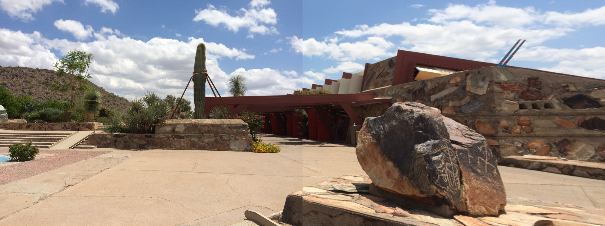

# Image-Mosaicing

The notebook may take a long time to load on GitHub. Use the jupyter notebook viewer: [nbviewer](https://nbviewer.jupyter.org/github/BonJovi1/Image-Mosaicing/blob/master/code.ipynb) \
Estimating the homography between images and stitching them together to form a panorama. Stereo correspondences are computed using various techniques to understand stereo calibration. 

### Image Stitching
1. We use ORB matching to find matches between two partially overlapping images. 
2. We then estimate the homography matrix between the two images robustly and transform one of the images to the other's reference frame using the homography matrix. The homography is built from scratch, without using any inbuilt functions. 
3. We then stitch the two images together.
4. And we repeat this for multiple images to produce a singly mosaic/panorama.

We get something like this:

A nice mosaic of the amphitheatre at IIIT. 

### Stereo Correspondences
- We perform Intensity Window-based correlation on the given pair of images.
- We rectify the pairs of images and with these new images, and then again perform intensity window-based correlation. 
- We compare the results with Greedy Matching and Dynamic programming solution for Stereo Correspondences.
- We also perform dense SIFT-based matching on the given pair of Images and give the comparison with that of Intensity window-based correlation.
